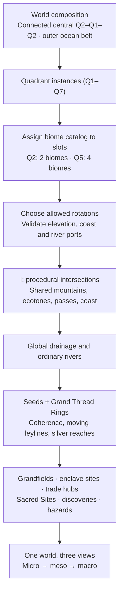

# Gateway to Genesis: Implementation Roadmap

What the game has, what it still needs, and in what order, measured against the vault's **97 achievements**
(`Worldbuilding/Events/Achievement.md`, imported verbatim to `Resources/Achievements/Achievements.md`). An
achievement only makes sense once every system it names exists, so the achievements are the checklist: each one
below lists the systems it waits for. Architecture and conventions for building these are in
[ARCHITECTURE.md](ARCHITECTURE.md). This file now contains the visual delivery plan (section 4) and the canonical 62-task backlog (section 8). The external shared tracker was not verified or synchronized during this review.

Reviewed September 27, 2026: **97 definitions, 12 wired predicates, and one separate direct-profile sacrifice award**. None is newly gameplay-certified by this documentation review. The modernized world, Age loop, Pantry, fragments, Ballad casts and persistence now require integrated acceptance. Follow [the current phases](../../../Docs/Planning/PHASED_ROADMAP.md), [agent handoff plan](../../../Docs/Planning/ACHIEVEMENT_INTEGRATION.md) and [97-entry coverage register](../../../Docs/Planning/ACHIEVEMENT_COVERAGE.csv).

[Current phases](#4-delivery-phases--reviewed-september-27-2026) · [62 implementation tasks](#8-executable-task-backlog) · [Sources and decisions](../../../Docs/Planning/SOURCES_AND_DECISIONS.md)

> **Owner clarification, 2026-09-27:** legends can acquire Ornaments in Age 0. The restriction concerns Ornamental Magic in Symphony of War and other symphonic cards, not legend development. Settlement Ornaments keep their separate Truth/three-complete-Ages gate. See D13 in the decision register.

## 0. The first playable loop (built September 26, 2026)

The owner asked for one thin, playable slice through the whole loop: **resources → technology → world map → more
resources → legends and ballads → growing them → Acts of Fate → halfway through the Age the crisis begins → the crisis
resolves → the next Age, with new things on the map.** It cuts across S02, S04, S07, S11, S13 and S15 at prototype
depth; every number is a proposal (D01–D03, D07, D08) kept in assets. Its world map is the simple quadrant version;
section 3.1's quadrant-based generator is meant to replace `WorldGenerator`'s fill behind the same `WorldMap` interface.

| Loop step | What exists | Where |
|---|---|---|
| Technology → world map | Researching Reconstruction opens expeditions (M, or the Age banner); each Hollow Watchpost sends one more at a time | `WorldSystem`, `Resources/World/World.asset` |
| World map → more resources | The quadrant-built world of section 3.1 (about 34,000 cells, three zoom readings, entered by scrolling out of the capital); expeditions explore the ground around their target; explored ground and its features yield resources every second (flat production through `EffectRouter`, one source per kind of land) and pay one-time rewards | `WorldGenerator`, `WorldMap`, `WorldMagic`, `WorldSystem`, `WorldView` |
| Getting legends | Two legends known at the start; Survivor Hamlets (Age 0) and the Memory Field (Age I) bring the others; the council offers only met legends | `LegendProgress`, `LegendLeaderLogic` |
| Ballads | *The Ruin-Song*: three verses (two Silent Spires, then the Age of Renewal) | `Resources/Events/Ballads.ink` |
| Growing legends | Lyrical Fragments from expeditions, Ballad roles, council Acts/crises and soul events now drive rank and binding growth; legacy renown consequences pay Meaning fragments | `LyricalFragments`, `LegendProgress`, `BalladActors` |
| Acts of Fate | Three Acts per Age (four in the long Ages), a story at each boundary | `AgeRules`, `Resources/Ages/*.asset` |
| Crisis at halfway | The Inescapable Hunger begins at 50% unannounced (harvest golden → pink), is named at 72% (banner turns red, Food output falls with severity), then the Ash-Bread Winter and the Choosing of Seeds | `AgeProgression`, `CrisisRules`, `AgeOfDesolation.ink` |
| Age change | At the Age's end the crisis resolves (severity from named factors; deaths never below the survivor floor, the homeless first), `GameAge.Set`, a passage card, *The Brown Auric Peach* | `AgeProgression.Pass`, `AgeBanner` |
| Repeat, new things on the map | The Age of Renewal places Agromagical Conclaves, a Memory Field and Secluded Refuges; its Great Plague uses the same machinery and branches to Age II by severity (Behemoths / Glyphs / Embers, a D02 placeholder); Age II has no crisis yet, so the chronicle rests there | `Age of Renewal.asset`, `AgeOfRenewal.ink` |

Historical slice verification was recorded with `GenesisLoopTests` (38 pure tests), `ContentTests.TheAgesTheWorldAndTheirStoriesFitTogether` and
`GenesisLoopPlayTests` (opens ClickerScreen, plays the Age of Desolation through its six stories into the Age of Renewal).

**Next:** the owner playtests pacing (one Act = one Echo, 63 sevenths) and severity; decide D01–D03 and re-tune; real
Age I content (technologies; the vault's Age of Renewal note is empty); S01 scene/recovery acceptance, since a run now spans
Ages; the section 3.1 generator is in (September 27, 2026): tune its world size and pacing in play.

## 1. What the game has today

| Built system | What it covers | Achievements it already awards |
|---|---|---|
| Time | Seventh, Phase, Echo, Cycle; pause | — |
| Economy | Resources, buildings and units, research, click power, production rates | — |
| Population | Citizens, housing, vagrants, food, deaths and the revisable death ledger | *The Trolley That Kept Moving* |
| Stats | Pillars, aspects, derived stats, morale, satisfaction, the `dark_morale` score | — |
| Council | Head of State, six positions, seats (Resources/Council), legends, activation, cooldowns | *A League of Legends* |
| Civics | Tiers, slots, requirements, removal penalties, civic seats | — |
| Weather | Procedural celestial weather and its effects | — |
| Events | Ink volumes, consequences, chorus luck challenges (odds, criticals, Piety) | *Heads, You Vanish*, *Butterfly Survives the Storm*, *The Aria Was Listening That Day* |
| White-Haven Library | Glossary (vault lore) and Game Wiki, keyword cards | *An Eccentric Madman* |
| Achievements | The vault's list, unlock rules, toast, Game Wiki shelf | (the system itself) |
| Legend souls | Soul Leitmotif and Ornaments, Legend Traits read from the vault's Legend Trait note (Wish, Expression, middle traits), seven binding scores, Composure's five states under the council's crises and its dead, Motif Awakening, the Catalytic Abyss, legends lost to Dissonance | *Alchemical Pelican*, *You Are Filled With Determination*, *The Crux of Nigredo*, *Let's Go To Therapy!* |
| Expeditions | Legends walk the world in parties led by a Director (no generic scouts or settlers), slots from Government Capacity, the road's hardship on Composure, mishaps that strike its legends, settlers escorted to found towns | (feeds the four above) |

The Ages pass (section 0: Age of Desolation → Age of Renewal → an Age II placeholder); versioned world saves and a lifetime profile are implemented; current scene/recovery acceptance remains open.

## 2. Systems to build

Each system has an id (used by the achievement map in section 5 and by the tracker), what it is, the vault notes
that already describe it, and the gaps the vault still has (notes that are missing or empty). Gaps are the vault's
to fill; the game keeps placeholders for them and lists them in `Resources/Library/Vault~/Canon Gaps.md`.

| Id | System | What it is | Vault anchors | Vault gaps |
|---|---|---|---|---|
| S01 | Save/Load and profile | Run saves (ledger sources, not totals, re-applied on load) and a profile that outlives runs: unlocked achievements, Resonance Anchors, Ironman flag | ARCHITECTURE §10.1 | — |
| S02 | Ages and Age Transitions | Public Ages 0–XIII plus hidden XIV, Acts of Fate and Triadic Pivots, what each unlocks, the passage between them, surviving an Age | Ages, Cycle, Gateway To Genesis | Age Transition |
| S03 | Age types | Classical, Golden, Dark, and the Requiem (Dark after Golden) and Cadenza (Golden after Dark) variants | Ages | Golden Age, Dark Age (no notes); Classical Age (empty) |
| S04 | Age Crises and Cataclysmic Aftermath | Crisis per Age (The Inescapable Hunger, Great Plague, Polychord Crisis...), the board wipe that keeps technologies and truths | Age Crisis, Cataclysmic Aftermath, The Inescapable Hunger, Great Plague, Polychord Crisis | — |
| S05 | Resets and prestige | Divine Resets, the Second/Third/Fourth Reset, The Ultimate Weapon's master key, Resonance Anchors bought with achievements | Cataclysmic Aftermath, Second Reset, The Ultimate Weapon, Gateway To Genesis | Divine Reset, Third Reset (no notes); Resonance Anchors (11 bytes) |
| S06 | Game modes | Ironman (no manual saves, permanent decisions, +50% Lyrical Fragments) | Gateway To Genesis | — |
| S07 | World Map and Capital View | The generated hex world and the zoomed-in Capital (section 3) | Arcanoria (Map Features) | the hex and quadrant design is game design, not in the vault |
| S08 | Settlements and Administrative Authority | Capital, Major Settlements, Developing Towns, Outposts; Government Capacity; City Development; Ornaments; losing, ruins and reclaiming; monuments | Arcanoria (Map Features), Major Settlement, Developing Town | Administrative Authority (42 bytes) |
| S09 | Trade and Leylines | Trade Nodes, Routes and Nexus; Leylines and Coherence zones on the map | Arcanoria (Map Features), Soliton | — |
| S10 | Enclaves | City-states between civilizations: origin wounds, suzerainty, integration | Enclave, Institute | — |
| S11 | Exploration | Expeditions, Landmarks, Memory Fields, contact with Outer Gods, fog of war | Memory Field, Outer God, Crescent Mist Peaks | Expedition, Landmark (no notes) |
| S12 | Stellar Legacy Score | Ascension into Constellations, Myth Grade, Mythic Drift, Myth Purification, Syncretism, Lyrical Fragments, Underdogs, Magnum Opus, liberation into The Eternal Symphony | Stellar Legacy Score, Constellation, Stardust | Mythic Drift, Myth Purification, Syncretism, Myth Grade (no notes); Lyrical Fragment, Magnum Opus, Slayer Magnum Opus (empty) |
| S13 | Legend development | Legend Traits (origin, personality, spellweaving; maladaptive and toxic; Apex), Composure levels (Spiraling, Catalytic Abyss), Motif Awakening, Ornaments, Weight of Potential, deeds | Legend Trait, Composure, Motif Awakening, Fundamental Frequency, Soul Leitmotif | Apex Trait (section of Legend Trait only); Legend (202 bytes) |
| S14 | Legend Relationships | Affection, Echoing Bonds, Romantic Interest, severance | Legend Relationship | Romantic Interest (section only) |
| S15 | Ballads, Fate Stage and World Events | Narrative campaigns, roles and Major Actors in the Fate Stage, World Events | Ballad, Fate Stage, The Hollowing, The Golden Light in the Sky | World Event, Major Actor (no notes) |
| S16 | Civic evolution | Starting civics, Fanatical, Cusp and Dissonance civics, reform and syncretism, adopting from ruins, Ideological Condemnation | Civic | Fanatical, Ideological Condemnation (no notes) |
| S17 | Morality and memory | Atrocities (outlawing, committing, justifying, refusing), historical revisionism and exposing it, Scorching Truths shared, Dark Morale revolts, unspeakable acts | Atrocity, Scorching Truth, Weight of Value | Dark Morale (no note); Atrocity (195 bytes) |
| S18 | Religion and Faith | Founding a religion, Piety output, Prophet civics | Piety | Prophet (no note); Religion (empty); Piety (22 bytes) |
| S19 | Magic Arts | Branches of Magic Arts, outlawing and legalizing Forbidden Magic, Ceremonial Arts (rhythmic clicking with Symphony Cards), Divination and Prophetical Arts | Magic Arts, Click Power, Symphony Card, Spellweaving | Forbidden Magic, Ceremonial Arts, Divination Arts, Prophetical Arts (no notes) |
| S20 | Spellweaving combat | The Symphony of War: composition (macro) and performance (micro), Chord Layering, Minor Notes, Visualization and Abjuration phases, Discordant Interference, six-hex formations, Mythical Victories | Combat System, Chord Layering, Discordant Interference, Gateway To Genesis | Minor Note (empty) |
| S21 | Atonalis | Birth, stages (Nascent, Sectile, Fracted, Ascendant), Primal Discordia, feeding and mimicry, Dissonance Cores, Rose Seeds, Soul-Key liberation | Atonalis, Primal Discordia, Soul-Key, The Cradle of Echoes | Sectile, Fracted, Ascendant, Dissonance Core, Rose Seed (no notes of their own) |
| S22 | World Truths | Scorching Truths discovered, the origin of the Atonalis, The Truth of Arcanoria | Scorching Truth, The Truth of Arcanoria, We Are Atonalis | — |
| S23 | The Sonata | The main story across Ages: Lacrimosa, the Crusades of Age V, the Moon's relics, the Third Actor, the endings of The Hollowing | Lacrimosa, Law of Relics, Parlor of the Moon, Singer of Paradise, The Hollowing, Mira | Sonata, Holy War, World-Bending Relics (no notes); Silver Blood (empty) |
| S24 | Resonance economy | The Dual Confluence Stream and Static Criticality | Static Criticality, Dual Confluence Stream | — |
| S25 | Other civilizations | Rival civilizations and diplomacy: settlements lost to them, condemnations, their ledgers | Arcanoria, Enclave | — |

## 3. The World Map and the Capital View (S07)

The first prototype had a world map; this brings it back as the second of two views of the same game.

**Capital View** is what the game is now: the zoomed-in capital (vault: "One per empire and it's the one you have
zoomed-in view of"), where the economy, population, council and events play out.

**World Map** is a generated map of hex tiles around it:

- **Grid.** Pointy-top hexes in axial coordinates (q, r); Unity's Grid with the Hexagon cell layout and a Tilemap for
  terrain, so painting and hit-testing come from the engine. Distances and neighbours are pure math (`HexCoord`),
  tested like the other rules.
- **Quadrants and Macro Biomes.** The stencil's quadrant instances (Q1–Q7) each have a constrained biome catalog and placement slots. Shuffle and rotate eligible biome recipes within those slots, then generate the intersections from shared terrain, climate, river and coast constraints. Q2 contains Violet Grove/Great Expanse; Q5 contains Taiga/Magical Rift/Wind Plains/Auric Grasslands. See section 3.1 for the current design.
- **Premade pieces.** Hand-authored `MapChunk` assets (a small hex pattern plus features: a Landmark, a Memory
  Field, an Enclave, a ruin, a Leyline crossing) are stamped into quadrants that allow them. They carry the vault's
  named places, so lore locations exist in every run without the whole map being fixed.
- **Generation** is a pure function of a seed, generator version, content catalog and settings (`WorldGenerator`), so future persistence can retain the versioned recipe, biome assignments and what changed, and tested without a scene.
- **What lives on tiles:** terrain and environment, Coherence and Leylines (S09), owner and Administrative Authority
  (S08), settlements (Capital, Major Settlement, Developing Town, Outpost), Enclaves (S10), features and fog of war
  (S11).
- **Switching views:** the Capital is a tile; opening it shows the Capital View, and the map shows every other
  settlement as a tile-sized summary. Time keeps running in both.

Milestones: (1) `HexCoord`, `WorldMap`, `WorldGenerator` with tests; (2) Tilemap rendering, camera and the switch
between views; (3) settlements and Administrative Authority on the map (S08); (4) fog of war and expeditions (S11);
(5) Leylines and trade (S09); (6) Enclaves and other civilizations (S10, S25).

### 3.1. Current priority: quadrant-based world generation

**User direction: begin with the world prototype before the Age slice.** Q1–Q7 are quadrants containing shuffled Macro Biome slots; W is water; I is the generated intersections between them. This replaces section 3's earlier idea of independently filling four quarters from a single environment profile. The existing S01–S25 system IDs remain; WG tasks below refine S07/S09 and their interfaces.

[Full world generation design: slots, seams, magic, features and zoom](../../../Docs/Planning/WORLD_GENERATION.md)

**Composition:** Q2 shuffles Violet Grove and Great Expanse. Q5 shuffles Taiga, Magical Rift, Wind Plains and Auric Grasslands while retaining a mountainous quadrant identity. Rotations respect shared geographic constraints. The intersections are not a randomly chosen filler biome; they solve the connections. Preserve the image's quadrant arrangement as a composition template; do not display its rectangular construction seams in final terrain. Keep a connected ocean belt around the assembled mainland, rather than cutting every adjacent quadrant off with a compulsory central moat.

**Three scales:** proposed interior ratio is 7 micro hexes per meso strategy cell and 49 meso cells per macro aggregate. Each reference quadrant spans multiple aggregates. Parent borders are exact unions of child cells; they are not falsely presented as perfectly nested regular hexagons. Rivers, coastlines and ownership use the same world coordinates at every zoom. Final ratios remain a prototype choice.

**Two fertility fields:** soil/water/climate determine land fertility; Coherence, usable flow and affinity determine magical fertility. Seed-derived leylines move by Age, Sacred Sites remain fixed, and physical rivers acquire silver Lunehymn reaches where infused. Two distinct lineages meet as a Convergence; three or more in one local hotspot form a Basin. River/leyline crossings and magic-only intersections are different feature types.

#### World implementation queue

**Status, September 27, 2026 (uncommitted):** WG01–WG11 are built at prototype depth and replace the old four-quarter generator; WG12 has its engine (Age commit and forecast) but only a forecast layer, not the debug Age selector; WG13 has its seed suite and timings, not device profiling. Checked by `WorldGenerationTests` (29 pure test runs), `ContentTests` (the real stencil, tiles and catalogs through the solver) and `WorldViewPlayTests` (scroll out of the capital, through the readings, and back), plus screenshots of every reading and overlay. Owner decisions taken: each same-quadrant stencil block is one slot; **Q5 has three slots, so each world draws three of its four biomes** (with its mountain range along its own intersections); Q1, Q3, Q4, Q6 and Q7 use placeholder catalogs (the four Age 0 environments and "Quadrant 7 (placeholder)", repeats allowed) until their biomes are named. Numbers (8 cells per stencil cell, about 34,000 cells; river and lake thresholds; seed strengths) are proposals in `World.asset`.

| Task | State | Where |
|---|---|---|
| WG01 recipes | Built: `QuadrantSpec`, `MacroBiomeSpec`, `TerrainRule`, stencil slots with tags, handmade tiles; missing or short catalogs are reported | `WorldSettings`, `WorldStencil`, `TileTemplate`, `ContentValidator` |
| WG02 coordinates | Built: index-7 lattice, micro/meso/macro, exact ownership at negative coordinates, true union outlines | `HexHierarchy` |
| WG03 topology | Built: warped stencil, reserved ocean apron (ring width checked), mainland connectivity with carved bridges, lakes never cut a slot off | `WorldGenerator` |
| WG04 slots | Built: seeded most-constrained backtracking, allowed orientations, tag requirements, seam heights, logged relaxations | `SlotSolver` |
| WG05 seams | Built: every slot within reach blends its recipe (continuous), the intersections' own ground, Q5's range, one smoothing pass, coherent patch noise | `WorldGenerator` |
| WG06 water | Built: continental dome, priority-flood drainage with hashed ties, lakes (4–80 cells), rivers, land fertility; capital on freshwater | `WorldGenerator` |
| WG07 seeds | Built: Coherence Seeds per slot, Dissonance Seeds, Sacred Sites (protected radius 2) | `WorldMagic` |
| WG08 leylines | Built: curves through the Grand Thread Rings' field, one family per seed, Convergence (2) / Basin (3+) by family | `WorldMagic` |
| WG09 silver | Built: infusion at crossings, downstream transport with tributary dilution, residue after an Age | `WorldMagic` |
| WG10 features | Built (Sept 27): multi-cell grandfields with Outpost extraction, Trade Nexus sites, threats with a danger field, Age-gated enclaves; plus settlements, City Development, roads, Resonance Anchors and lenses (WORLD_GENERATION.md, "Civilization layer and lenses") | `WorldSites`, `WorldCivilization`, `CityDevelopment`, `WorldLenses`, `World.asset` |
| WG11 viewer | Built: one-quad shader with three readings, rivers/leylines/markers meshes, overlays, selection, frontier, expeditions, hover; scroll transition with the capital | `WorldRenderer`, `WorldView`, `Resources/World/Shaders` |
| WG12 Age migration | Engine built (`Apply` once per Age, `Forecast`), forecast layer in the view; debug Age selector and transition overlay open | `WorldMagic`, `WorldSystem.OnAgeBegan` |
| WG13 acceptance | Seed suite, determinism, catalog hash, report; generation about 0.5–0.65 s, an Age change about 12 ms on the dev PC; target-device profiling open | tests, `WorldGenReport` |

Original plan: each task closes with pure-rule checks plus the visual inspection relevant to its output. X02/X03 remain the baseline/contracts prerequisite; save/load implementation is now authorized (2026-09-26).

- **WG01 — Quadrant and biome recipes** (S07; design + engineering). Define instance IDs, catalogs, slot counts, allowed rotations, interior/buffer masks and boundary ports. Depends: current user-approved model. Accept: Q2 has exactly its two biomes; Q5 exactly its four; missing catalogs produce explicit authoring errors.
- **WG02 — Hierarchical coordinates** (S07; engineering). Implement and verify the proposed axial parent mapping. Depends: WG01. Accept: unique ownership, negative coordinates, exact interior child counts, boundary handling, aggregate conservation and stable world selection.
- **WG03 — Continental topology and ocean** (S07; engineering + design). Convert the reference composition into constraints; reserve mainland links, ocean circuit and spawn opportunities. Depends: WG01. Accept: core connected; navigable ocean route encloses mainland; mandatory connections survive coastline variation.
- **WG04 — Slot shuffle and rotation solver** (S07; engineering). Seeded constraint assignment with bounded backtracking and logged fallback. Depends: WG01, WG03. Accept: valid permutations vary by seed; all required biomes appear once; impossible rotations/ports are rejected; random streams are independent.
- **WG05 — Procedural intersections** (S07; engineering + terrain design). Solve the shared mountain/climate fields, port joins and buffer blending. Depends: WG04. Accept: no gaps, duplicate ownership or cliff walls at ordinary seams; four-way junctions work; Q5 reads as one mountainous quadrant.
- **WG06 — Water and physical fertility** (S07; engineering). Drainage basins, lakes/outlets, river refinement, soils and land fertility. Depends: WG05. Accept: valid flow directions, continuous cross-region rivers, reproducible wet/dry fields and reachable starting freshwater.
- **WG07 — Seeds and Coherence fields** (S09; engineering + design). Positive/negative sources, fixed Sacred Site protection, affinity and magical fertility. Depends: WG05. Accept: isolated-source falloff works, core/source identities remain distinct and the two fertility fields can diverge.
- **WG08 — Ring-driven leylines and junctions** (S09; engineering). Route distinct seed-sourced lineages and classify local intersections. Depends: WG07. Accept: two lineages yield Convergence, three-plus yield Basin; forks/segments cannot inflate counts; paths cross region seams continuously.
- **WG09 — Silver river reaches** (S09; engineering). Infusion, downstream transport/dilution and residual decay. Depends: WG06, WG08. Accept: silver reaches follow actual water flow; distant rivers do not change; full-resolution crossings survive zoom simplification.
- **WG10 — Feature distribution** (S08/S10/S11/S09; design + engineering). Place grandfields, protected sites, discovery hooks, nexus opportunities and Age-appropriate enclave candidates. Depends: WG06, WG09. Accept: exclusion/scarcity/access rules hold, Age 0 is not fully populated with advanced institutions, and grandfield bonuses are not duplicated per tile.
- **WG11 — Three-level map viewer** (S07; engineering + UI). Batched terrain, same-position zoom, selection, biome/soil/magic overlays and pooled feature markers. Depends: WG02, WG06. Accept: no regeneration or changed ownership on zoom; changing overlays exposes the same geography. Integrate magic overlays as WG07–WG10 land.
- **WG12 — Age migration preview and commit** (S02/S09; engineering). Debug Age selector first, then real Age events; forecast old/new leylines, silver reaches and route efficiency. Depends: WG08, WG09, WG11, X03. Accept: geography and Sacred Sites remain fixed; mutation commits once; buildings/trade links are not silently deleted.
- **WG13 — Generator acceptance and profiling** (S07/S09; QA + engineering). Seed suite, unsatisfiable-catalog cases, feature budgets, determinism/versioning and target-device measurements. Depends: WG10, WG11, WG12. Accept: all invariants in the design document pass; report generation/memory/chunk/zoom/Age-update costs before choosing production world size.

**First concrete milestone:** WG01–WG06 plus WG11: a navigable three-scale continent with reproducible Q2/Q5 placement/rotation, seamless intersections, the enclosing ocean and continuous ordinary rivers. **Second:** WG07–WG10 and WG12: moving magical geography, silver water, fertility and meaningful features. **Third:** WG13 and integration with civilization/Age systems. These are generation deliverables, not claims that full diplomacy, combat or settlement simulation ship with the first viewer.

## 4. Delivery phases — reviewed September 27, 2026

[PHASED_ROADMAP.md](../../../Docs/Planning/PHASED_ROADMAP.md) is the current phase schedule; [ACHIEVEMENT_INTEGRATION.md](../../../Docs/Planning/ACHIEVEMENT_INTEGRATION.md) contains executable integration waves and agent handoffs. They supersede the September 26 implementation queue, preserving all S/X/WG identifiers.

1. **P0 / U00:** baseline, stable identity/evidence, award transaction, coverage and shared ownership contract (X02–X04).
2. **P1 / U01:** accept existing Hunger/Plague/Pantry loop, real Age gates, twelve wired predicates and five Age-type/history predicates (X05/X06, S02–S04).
3. **P2 / U02:** accept world/settlement/trade/enclave foundations and add historical provenance, loss/reclaim and civic inheritance (WG12/13, X07, S08–S11).
4. **P3 / U03–U04:** extend existing fragments/casts into relationships, legacy, Symphony of War and Atonalis (S12–S14, S20/S21, X08).
5. **P4 / U05:** integrate civics, actual/official history, religion, magic laws, resonance and rivals (S16–S19, S24/S25, X09).
6. **P5 / U06:** campaign increments, truths, settlement Ornaments, prestige upgrades, Ironman, resets and endings (S04-B/S05/S06/S08-B/S15/S22/S23, X10/X11).
7. **P6 / U07:** certify every included unlock with production, negative, repeat/reload and player-flow evidence (X12).

Current queue: U00 → U01; then U02 and U03 can advance in separate claimed scopes after their contracts are stable. U04/U05 consume their outputs; U06 integrates campaign routes; U07 certifies. Roles are not dispatched agents. Follow the handoff protocol before shared-file edits.

Persistence is authorized. Generator version 8 and save schema 3 are present; older snapshots are historical. Source inspection confirms implementation, not current compilation or Play Mode success. Canon decisions remain explicit; numbers are proposals until accepted. Legends may acquire Ornaments in Age 0; restricted Ornamental Magic/cards remain separately gated. Settlement Ornaments require The Truth and three complete Ages, and completion cannot require its own achievement.

## 5. Achievements and the systems they need

✅ means a predicate is wired, not freshly verified earnability. The rest list supporting systems; use the coverage register for integration dependencies, wave and acceptance status. #96 also has a direct profile award in SaveSession.Sacrifice, with playable final-choice acceptance outstanding. Titles are the vault's, without link brackets.

### Progressing through Ages

| # | Achievement | Earned by | Needs |
|---|---|---|---|
| 1 | The Brown Auric Peach | Survive through Ages 0 | ✅ (first playable loop) |
| 2 | It's the Moths! The Moths! | Survive through Ages I | ✅ (first playable loop) |
| 3 | You, too, deserve the Purest of Love | Survive through Ages II | S02, S23 |
| 4 | The Law of Relics | Survive through Ages III | S02, S23 |
| 5 | Throne of Atonalis | Survive through Ages IV | S02, S04, S21 |
| 6 | A World Broken by a Holy War | Survive through Ages V | S02, S23 |
| 7 | Behold The Master-Key! | Survive through Ages VI | S02, S04 |
| 8 | 0 x 4 x 7 | Fail in the Cataclysmic Aftermath of Ages VI | S04, S05 |
| 9 | 3 x 4 x 0 | Fail in the Cataclysmic Aftermath of Ages XI | S04, S05 |
| 10 | 3 x 0 x 7 | Fail in the Cataclysmic Aftermath of Ages XIII | S04, S05 |
| 11 | Metanoia | Enter a Golden Age for the first time | S03 |
| 12 | Anagnorisis | Enter a Dark Age for the first time | S03 |
| 13 | The Darkest Hour | Enter a Requiem Dark Age | S03 |
| 14 | Ignis Aurum Probat | Enter a Cadenza Golden Age | S03 |
| 15 | The Strauss-Howe Prophecy | Experience all types of Ages | S03 |
| 16 | Welcome to Arcanoria | Reach the end of the Second Reset and start a Civilization in the Third Reset | S05, S01 |

### Ballads

| # | Achievement | Earned by | Needs |
|---|---|---|---|
| 17 | An Eccentric Madman | Meet The White-Touched Archivist | ✅ (opening the White-Haven Library) |
| 18 | Goodbye, Mother | Finish the Ballad of Eyras and The Cradle of Echoes | S15, S20, S21 |

### Stellar Legacy Score

| # | Achievement | Earned by | Needs |
|---|---|---|---|
| 19 | Released into Stardust | Liberate a Constellation into The Eternal Symphony | S12 |
| 20 | Bundle of Joy | A Legend with three Maladaptive or Toxic middle Legend Traits | S13 |
| 21 | Alchemical Pelican | The Motif Awakening of a Legend to any Ornament | ✅ (S13-A prototype) |
| 22 | You Are Filled With Determination | Recover from Spiraling Composure, evolve a trait and awaken a motif | ✅ (S13-A prototype) |
| 23 | The Cave's Exit | A Legend shares a Scorching Truth and is rejected, imprisoned or executed | S13, S17, S22 |
| 24 | The Crux of Nigredo | A Legend reaches the Catalytic Abyss of Emotion | ✅ (S13-A prototype) |
| 25 | Let's Go To Therapy! | A Legend reaches Spiraling Composure | ✅ (S13-A prototype) |
| 26 | Kenosis of a Star | Ascend a Legend into a Constellation during an Age Transition | S12, S02 |
| 27 | A League of Legends | Fill the council: 6 Legends and a Head of State | ✅ |
| 28 | Palimpsest of the Stars | Trigger Mythic Drift for a Constellation | S12 |
| 29 | Apocatastasis | Use Myth Purification on a Constellation | S12 |
| 30 | Interpretatio Aeterna | Use Syncretism to merge two Constellations | S12 |
| 31 | Tathāgata of the Soul Leitmotif | A starting Personality trait becomes an Apex Trait | S13 |
| 32 | The Stone The Builders Rejected | An Underdog produces 3× Lyrical Fragments on one action | S12, S13 |
| 33 | Despite Everything, It's Still You | An Underdog reaches the highest Myth Grade | S12 |
| 34 | Poiēsis in Flesh | Forge a Legend's Magnum Opus | S12, S13 |
| 35 | The Thirteenth Labor | Forge a Slayer Magnum Opus | S12, S20, S21 |
| 36 | The 10,001st Hour | A 3-Star Apex Spellweaving trait | S13 |
| 37 | An Infatuated Obsession | Romantic Interest reaches Infatuated one way only | S14 |
| 38 | The Crystal Jar | A Legend crushed by the Weight of Potential | S13, S22 |
| 39 | Aw.. Hell Nah | A Legend performs an unspeakable act | S13, S17 |

### Culture, Civics and Civilization

| # | Achievement | Earned by | Needs |
|---|---|---|---|
| 40 | Soul Leitmotif of Civilization | A fully Ornamental Major Settlement; three complete Ages and The Truth of Arcanoria | S08, S02, S22, S20 |
| 41 | Ship of Theseus | None of your original starting Civics | S16 |
| 42 | Digestive Rebirth | Reform or adopt a Civic from the ruins of a fallen settlement | S08, S16 |
| 43 | Static Criticality | An imbalance of the Dual Confluence Stream | S24 |
| 44 | Compost Your Failures | Use achievement-bought Resonance Anchors for permanent upgrades | S05, S01 |
| 45 | Iron Will, Fragile World | Reach the end of an Age Crisis in Ironman mode | S06, S04, S01 |
| 46 | Heads, You Vanish | A Critical Failure in a luck-based challenge | ✅ |
| 47 | Butterfly Survives the Storm | A Critical Success at Forsaken odds (10% or less) | ✅ |
| 48 | The Aria Was Listening That Day | Piety saves a decision that should have failed | ✅ |
| 49 | Modernity Bites Back | A modernization World Event reforms a Civic held for over two Ages | S15, S16, S02 |
| 50 | Overton's Threshold | Adopt a Fanatical Civic | S16 |
| 51 | Slippery Slope | Adopt a Cusp or Dissonance Civic beyond your initial ones | S16 |
| 52 | Kenotaph | A Constellation Monument to a Legend lost to tragedy | S08, S12 |
| 53 | Hume's Guillotine | Justify an Atrocity | S17 |
| 54 | The Trolley That Kept Moving | Revise the Death Count of an official ledger | ✅ |
| 55 | People Are Never Numbers! | Expose another civilization's revised death count | S17, S25 |
| 56 | Pascal's Compromise | A Religion with stable Piety without Prophet Civics | S18, S16 |
| 57 | Genesis 1:5 | Found a Religion | S18 |
| 58 | Friendship is Magic | Outlaw a branch of Magic Arts as Forbidden Magic | S19 |
| 59 | The Streisand Settlement | A Dark Morale revolt from a failed cover-up | S17 (luck challenges are built) |
| 60 | 404: City Not Found | Lose a settlement beyond your Administrative Authority | S08, S25 |
| 61 | Welcome Back, Traitors | Reclaim a lost settlement | S08, S25 |
| 62 | Anathema Sit! | Perform or receive an Ideological Condemnation | S16, S25 |
| 63 | Santayana's Condemnation | Commit an Atrocity outlawed in past Ages | S17, S02 |
| 64 | Chesterton's Atonalis | Legalize long-Forbidden Magic and trigger an Atonalis attack | S19, S21, S02 |
| 65 | Beacon in the Shadow of Gyges | Refuse every Atrocity for the whole set of Ages | S17, S02, S01 |

### Exploration

| # | Achievement | Earned by | Needs |
|---|---|---|---|
| 66 | Panthalassa | Two unrelated Enclaves that share an origin wound | S10, S11 |
| 67 | Rhythmic Baking | The first Magic Arts: Click Power in Ceremonial Arts with Symphony Cards | S19 (click power is built) |
| 68 | Here Be Monsters | An Expedition uncovers a ruined Landmark with an Atonalis fight | S07, S11, S20, S21 |
| 69 | Do Not Answer | Direct contact with an Outer God | S11, S23 |

### Atonalis and Spellweaving Combat

| # | Achievement | Earned by | Needs |
|---|---|---|---|
| 70 | Crack of Leitmotif | A Soul Leitmotif shatters into a Dissonance Core | S21, S13 |
| 71 | Parasitic Resonance | Fight an Atonalis's feeding process | S20, S21 |
| 72 | A Chinese Room of Hunger | A shapeshifting Atonalis mimics a dead Legend | S21, S13, S14 |
| 73 | Chekhov's Resonance | Chord Layering turns to Discordant Interference | S20 |
| 74 | Zeno's Crescendo | Correct Discordant Interference until the spell collapses | S20 |
| 75 | Arcanoria Moment 37 | Cancel a 15+ Minor Note stack, all Perfect | S20 |
| 76 | Fiat Resonantia | Vanquish a Primal Discordia | S20, S21 |
| 77 | Potemkin Buster | Cancel a 70%+ Composure spell with one defensive card | S20 |
| 78 | This is Gateway To Genesis | Lose every Divination and Prophetical attempt in one fight | S20, S19 |
| 79 | Veni, Vidi, Vici | A Mythical Victory in a fight destined to fail | S20 |
| 80 | Petals of Creation | A Rose Seed from an Ascendant or higher Atonalis | S21 |
| 81 | Elegy of a Rose Seed | Liberate the Soul-Key of a Legend you knew | S21, S13, S20 |
| 82 | Fated Flowers for Algernon | Plant a Fracted Atonalis's Rose Seed with its trigger object | S21, S13 |
| 83 | The Song From Halfway Down | Immortalize a falling Legend's last words | S21, S13 |

### World Events and Age Crisis

| # | Achievement | Earned by | Needs |
|---|---|---|---|
| 84 | Kojève's Winged Blindfold | Witness Lacrimosa's Resonance Motif Awakening | S23 |
| 85 | History is Written by the Victors | Become a Major Actor in a World Event | S15 |
| 86 | Across the Sea, to the Land Beyond | Uncover the story of Mira | S15, S23 |
| 87 | But It Refused | Reclaim your place as a Major Actor | S15 |

### Memory Fields and Scorching Truths

| # | Achievement | Earned by | Needs |
|---|---|---|---|
| 88 | We Are Atonalis | Discover the origin of the Atonalis | S22 |
| 89 | The Truth of Arcanoria | Uncover The Truth of Arcanoria | S22 |
| 90 | Searing Compendium | Uncover all the Scorching Truths | S22 |

### The Sonata of Arcanoria

| # | Achievement | Earned by | Needs |
|---|---|---|---|
| 91 | A Fragile Miracle | Any Alternate Ending of The Hollowing | S23, S15 |
| 92 | For the Moon! | Win the Crusades for the Silver Blood in Ages V | S23, S02 |
| 93 | For The Sovereign! | Win the Crusades for the Auric Aria in Ages V | S23, S02 |
| 94 | Parlor of the Moon | Tether Auric and Selenic World-Bending Relics to the Moon | S23 |
| 95 | The Singer of Paradise | Conclude the Sonata of Interwoven Threads of Gold and Silver | S23 |
| 96 | The Purest of All Love | Wish for the End of the Third Actor | S23 |
| 97 | Gateway To Genesis | 100% and Wish for the End of the Third Actor | every system |

## 6. The achievement note's own gaps

The import reports these lines in `Worldbuilding/Events/Achievement.md`; the game reads them as they are, and they
should be fixed in the vault:

- Italic quotes not closed (the final `_` or `*` missing): lines 76, 100, 121, 124, 171, 177, 241, 250, 267, 288,
  305, 311.
- Line 278, `_"Critically Thinking Hater: "_`, has no requirement above it and no flavor, so it is not in the game.

## 7. How a new system joins the achievements

1. Claim the task and producer scope using [the synchronization protocol](../../../Docs/Planning/ACHIEVEMENT_INTEGRATION.md#agent-synchronization-protocol).
2. Emit committed, identity-bearing domain evidence; coordinate AchievementSignal/payload changes with the integration owner. Persist history and deduplication for cumulative or whole-run rules.
3. Add the rule keyed by its existing stable ID; keep restoration and previews silent. Coordinate world/profile/Anchor transactions rather than bypassing them with a direct unlock.
4. Test the canon predicate, near-miss, duplicate, persistence and player flow. ContentTests checks referenced IDs; it does not establish reachability.
5. Update wiring and verification separately in the coverage register, with actual producer/test evidence. Mark accepted only after the wave exit gate passes.

## 8. Executable task backlog

Reconciled 2026-09-27. Task acceptance criteria remain contracts; foundation/prototype statuses below do not certify gameplay. Follow the U-wave overlay for current integration sequencing. IDs S01–S25 match the established roadmap. X tasks cover integration and validation. Dependencies are task IDs; D references are unresolved decisions in [the decision register](../../../Docs/Planning/SOURCES_AND_DECISIONS.md). Roles indicate responsibility, not assigned people. Acceptance criteria include the indicated rule tests plus a player-facing integration check where applicable. Sources refer to exact note titles in the source register.

### Foundation and integration tasks

### X01 — Resolve the slice's canon and balance contract
- Phase: P0. Owner: Design + narrative. Depends: none. Status: Ready.
- Deliver: decisions D01–D03 for Act timing, history scoring and famine survival; list remaining campaign decisions without blocking the slice.
- Accept: each decision distinguishes quoted/source-backed lore from proposed mechanics, names the owner, and records a worked example. No assumed numeric thresholds presented as canon.
- Sources: Ages; Age of Desolation; The Inescapable Hunger.

### X02 — Capture the current Unity baseline
- Phase: P0. Owner: Engineering + QA. Depends: none. Status: Engineering baseline captured 2026-09-27 (clean compile; 488/488 EditMode incl. 7 scene tests at 3847c22 + shared tree). Manual Capital smoke test still pending.
- Deliver: current working-tree inventory, Unity 6000.5.8f1 EditMode results, and Capital smoke-test record.
- Accept: existing failures are reproducible and separated from changes; economy, pause, population, council, events, Library and achievement UI each have a recorded result. Preserve current uncommitted work.
- Sources: ARCHITECTURE; current tests and ProjectVersion.

### X03 — Define shared state and domain events
- Phase: P0. Owner: Engineering. Depends: X01, X02. Status: Achievement slice implemented 2026-09-27 (evidence envelope v1, award transaction, alias migration; see ACHIEVEMENT_INTEGRATION U00 status). Age/Act/run/legend instance ids and typed transition/deed events remain.
- Deliver: stable Age/Act/run/entity IDs, seeded random ownership, typed transition/crisis/deed events, and a state lifetime contract for run, Age, settlement, legend and profile.
- Accept: examples cover a famine transition, a legend death and a future reset without duplicate modifier application; ledger sources are authoritative. Extend the implemented save schema and restoration contract without replaying effects or awards.
- Sources: ARCHITECTURE; Ages; Cataclysmic Aftermath.

### X04 — Correct the achievement dependency map
- Phase: P0. Owner: Design + QA. Depends: X01. Status: Register reconciled 2026-09-27 and enforced by AchievementRegisterTests (97 rows, 12 wired, 1 direct-profile); D04 still open.
- Deliver: audit all 97 listed achievements against actual prerequisites; correct settlement Ornaments, campaign history and persistence dependencies; record ending conflict D04.
- Accept: every definition maps to a trigger task or an explicit unresolved rule; six existing predicates remain distinguished from playtested unlocks; no unsupported per-phase completion totals.
- Sources: Achievement; Arcanoria; AchievementTriggers.

### X05 — Replace permissive Age unlocks
- Phase: P1. Owner: Engineering. Depends: S02-B. Status: Implemented 2026-09-27: EraUnlock via age/age_reached, fail-closed requirements, AgeCapabilities (legend Ornaments Age 0, Ornamental Magic Age III), validation; card-side check waits for U04 content.
- Deliver: real EraUnlock evaluation through shared conditions and content validation; refresh technologies, civics, sections and Age-sensitive keyword cards.
- Accept: content before, at and after an Age threshold is correctly locked/unlocked; unknown Age IDs fail validation; UI explains the requirement; Age 0 permits legend Ornaments but cannot expose restricted Ornamental Magic or symphonic cards; settlement Ornaments use their independent Truth/tenure gate.
- Sources: CivicData; GameAge; ARCHITECTURE; Age of Desolation.

### X06 — Accept the Age 0–I slice
- Phase: P1. Owner: QA + design. Depends: S04-A, S03-B, X05. Status: Planned.
- Deliver: prepared and unprepared famine scenarios, transition summary and Brown Auric Peach unlock integration.
- Accept: both routes reach Renewal once with correct distinct survivor totals; pause, repeated callbacks and restarting Play Mode do not duplicate effects; early Library content does not leak hidden XIV. Record playtest pacing and revise balance.
- Sources: Age of Desolation; Achievement; existing event/population rules.

### X07 — Accept the world loop
- Phase: P2. Owner: QA. Depends: S07-B, S08-A, S09-B, S10-B, S11-A. Status: Planned.
- Deliver: capital → expedition → discovery → settlement → trade → enclave contact scenario.
- Accept: fixed seed reproduces geography, all required starting features are reachable, and switching views never doubles simulation ticks. Validate the implemented save/profile round trip and record any current acceptance blocker.
- Sources: ROADMAP section 3; Arcanoria.

### X08 — Accept legend-driven encounters
- Phase: P3. Owner: QA + design. Depends: S11-B, S12-B, S13-B, S14-B, S20-B, S21-B. Status: Planned.
- Deliver: one complete expedition encounter and one Age-transition ascension scenario.
- Accept: combat choices produce exactly one outcome, deed, relationship update and fragment reward; death and ascension clean up council effects; seeded replay reproduces outcomes.
- Sources: Combat System; Stellar Legacy Score; Legend Relationship; Atonalis.

### X09 — Accept societal consequences
- Phase: P4. Owner: QA + design. Depends: S16-B, S17-B, S18-B, S19-B, S24-B, S25-B. Status: Planned.
- Deliver: civic reform, faith, forbidden-magic reversal, cover-up and diplomatic response scenarios.
- Accept: each consequence is traceable in history and UI, uses the existing modifier system, and cannot be farmed through repeated adoption/removal or repeated event delivery.
- Sources: Civic; Magic Arts; Atrocity; Static Criticality.

### X10 — Validate the campaign in increments
- Phase: P5. Owner: Narrative + QA. Depends: S15-B, S22-B, S23-A, S04-B, S05-A. Status: Planned.
- Deliver: route fixtures for Renewal/Great Plague, II–VI/Second Reset, Third Reset through XI, and Fourth Reset through XIII.
- Accept: every increment has a playable entry, alternate outcome and correct next state; prerequisite truths and reset-stage locks are tested before the next increment is authored.
- Sources: Ages; Cataclysmic Aftermath; The Hollowing.

### X11 — Reconcile completion and rewards
- Phase: P5. Owner: Design + QA. Depends: X04, X10, S23-B, S05-B, S06-B, S08-B. Status: Planned.
- Deliver: executable coverage for all agreed achievements and ending rewards, including history-wide conditions.
- Accept: no reward unlocks from missing/partial evidence; duplicates and restores are idempotent; the 100% condition has an explicit denominator and cannot require itself.
- Sources: Achievement; Cataclysmic Aftermath; D04.

### X12 — Release readiness
- Phase: P6. Owner: QA + engineering + design. Depends: X06, X07, X08, X09, X11, S01-B. Status: Planned.
- Deliver: supported-platform build, accessibility/input pass, content validation, migration/resume regression suite, and agreed performance budgets.
- Accept: complete campaign routes pass; large populations/maps/events meet measured budgets; text, audio cues, keyboard access and combat timing assistance are usable; no unresolved blocker is hidden by an aggregate test count.
- Sources: ARCHITECTURE; all phase acceptance records.

### S01–S05 — Persistence, Ages and resets

### S01-A — Implement versioned run/profile storage
- Phase: P2. Owner: Engineering. Depends: X03. Status: Implemented foundation — hold lifted by user; Play Mode acceptance pending.
- Deliver: separate profile/run schemas, stable-ID references, atomic writes and migration entry points; serialize ledger sources, random state and world seed/version/deltas.
- Accept: a round trip preserves economy, population, council, civics, weather, events, Age/Act/crisis and achievement IDs without serializing Unity object references or derived totals.
- Sources: ARCHITECTURE section 10.1; ROADMAP S01.

### S01-B — Restore safely and recover interrupted writes
- Phase: P2. Owner: Engineering + QA. Depends: S01-A. Status: Implemented foundation — hold lifted by user; Play Mode acceptance pending.
- Deliver: ordered hydration/reapplication, backup recovery, schema validation and fixtures expanded as later systems land.
- Accept: save/load during a pending decision or transition cannot duplicate rewards/modifiers; truncated/newer/older saves have tested handling; failed loads preserve the prior valid save and profile.
- Sources: ARCHITECTURE; AchievementTracker; X03 state contract.

### S02-A — Author the Age and Act catalog
- Phase: P1. Owner: Engineering + narrative. Depends: X03. Status: Prototype catalog exists for 0/I and placeholder II; complete canon catalog and acceptance remain.
- Deliver: data definitions for public 0–XIII and hidden XIV, named variants, per-Age Act counts, unlocks and crisis references; author 0 and I fully first.
- Accept: duplicate IDs, missing crisis references and invalid Act counts fail validation; II/V four-Act fixtures work; hidden XIV is absent from unrevealed player catalogs.
- Sources: Ages; Act of Fate; GameAge.

### S02-B — Advance Acts and Ages exactly once
- Phase: P1. Owner: Engineering. Depends: S02-A. Status: Prototype implemented in AgeProgression/AgeRules; replay/resume acceptance remains.
- Deliver: pure progression rules with explicit running, Act-resolution, crisis and transition states; integrate GameAge.Set and the existing time service.
- Accept: pause stops progression; boundary/repeated events cannot skip or duplicate Acts; large time advances follow a defined policy; a transition emits one historical record and updates all subscribers.
- Sources: Ages; Act of Fate; ARCHITECTURE.

### S03-A — Implement Era Score and Triadic Pivot rules
- Phase: P1. Owner: Engineering + design. Depends: S02-B, X01. Status: Partial prototype scoring exists; final D02 pivot/classification contract remains.
- Deliver: configurable score sources, excess-score crisis buffer and one-step Dark/Classical/Golden pivot evaluation at Act boundaries.
- Accept: threshold, tie and overflow examples match D02; no direct Dark-to-Golden pivot; restricted Age 0/I routes cannot be overridden by generic type logic.
- Sources: Ages; Age of Desolation; D02.

### S03-B — Record historical Age types and variants
- Phase: P1. Owner: Engineering + UI. Depends: S03-A. Status: Planned.
- Deliver: per-Act Era Score/fragment summaries, final historical classification, Requiem/Cadenza sequence rules and transition presentation.
- Accept: worked histories resolve deterministically under D02; golden-after-dark and dark-after-golden variants are distinguished; missing future fragment producers do not fabricate fragments or silently bias classification.
- Sources: Ages; ROADMAP S03; D02.

### S04-A — Build The Inescapable Hunger
- Phase: P1. Owner: Narrative + engineering + design. Depends: S02-B, S03-A. Status: Hunger/Pantry prototype implemented; D03 balance and current player-flow acceptance remain.
- Deliver: warning, preparation, escalation and resolution stages using Ink/events and existing population rules; configurable ecological and dietary risk represent hunger within apparent abundance.
- Accept: successful/poor preparation yield different survivor totals but both reach Renewal; losses never exceed population; effects apply once; restricted Ornamental Magic/cards cannot bypass Age 0 rules; legend Ornaments remain permitted under D13.
- Sources: Age of Desolation; The Inescapable Hunger; D03.

### S04-B — Generalize crises and Great Filters
- Phase: P5. Owner: Engineering + narrative. Depends: S04-A, S15-A, S22-A, S01-B. Status: Planned.
- Deliver: branching and concurrent crisis definitions, Great Plague, and VI/XI/XIII filter state machines with explicit survival/reset carryover policies.
- Accept: ordinary crises and Great Filters take distinct routes; failing the Second Reset's filter exposes the intended truth/stage; technologies, truths and losses follow the agreed per-filter contract, not a universal board wipe.
- Sources: Age Crisis; Ages; Cataclysmic Aftermath; D05.

### S05-A — Implement named reset stages and master-key tiers
- Phase: P5. Owner: Engineering + narrative. Depends: S04-B, S22-B. Status: Planned.
- Deliver: Second/Third/Fourth Reset stage separate from run count; four master-key tiers and transactional reset carryover.
- Accept: repeated Divine Resets do not incorrectly increment the named stage; VI/XI/XIII gates award the correct tier once; interrupted reset resumes consistently with profile and run agreeing.
- Sources: Cataclysmic Aftermath; Gateway To Genesis; D05.

### S05-B — Implement prestige and Resonance Anchor spending
- Phase: P5. Owner: Design + engineering. Depends: S05-A, X04. Status: Per-world Anchor awards and debit foundation implemented; permanent upgrade entitlements/reset carryover remain.
- Deliver: achievement-backed prestige currency and upgrade catalog with approved costs/effects; distinguish prestige Anchors from the lore's other uses of the term.
- Accept: earned currency and purchases survive resets; duplicate achievements/refunds/reloads cannot mint currency; UI previews permanent effects; no effect is applied twice after restore.
- Sources: ROADMAP S05; Gateway To Genesis; D06.

### S06–S10 — Modes and the world

### S06-A — Define persistent game-mode policies
- Phase: P5. Owner: Engineering + design. Depends: S01-B, S05-A. Status: Planned.
- Deliver: a mode flag created with the run, Standard/Ironman save permissions and irreversible-decision policy.
- Accept: Ironman removes manual-save/reload controls without removing crash recovery; normal mode remains unchanged; mode cannot be switched to evade a consequence.
- Sources: Gateway To Genesis; ROADMAP S06; D06.

### S06-B — Apply and validate Ironman rewards
- Phase: P5. Owner: Engineering + QA. Depends: S06-A, S12-A. Status: Planned.
- Deliver: +50% Lyrical Fragment policy and Iron Will, Fragile World trigger.
- Accept: rounding is documented for small awards; bonus applies once only in Ironman; a completed crisis is required; interruption/resume does not replay decisions or rewards.
- Sources: Gateway To Genesis; Achievement.

### S07-A — Generate a reproducible hex world
- Phase: P2. Owner: Engineering. Depends: X03. Status: Quadrant generator implemented (version 8); WG12/WG13 acceptance remains.
- Deliver: pure axial HexCoord, WorldMap and seeded WorldGenerator; quadrant stencil/slot generation, authored tiles, generator version and changed-tile state (the four-quarter proposal is superseded).
- Accept: neighbor/distance tests pass; fixed seed/settings/version reproduce tiles; named required features are placed with validated terrain constraints and reachable starting routes.
- Sources: ROADMAP section 3; Arcanoria.

### S07-B — Render and navigate both views
- Phase: P2. Owner: Engineering + UI. Depends: S07-A, X02. Status: Three-scale viewer implemented; current visual/device acceptance remains.
- Deliver: existing three-scale WorldView/WorldRenderer, selection, camera bounds, tile summaries and Capital/world switching.
- Accept: selection matches axial coordinates at map edges; returning to Capital retains state; both views share one time/economy simulation and input does not leak between views.
- Sources: ROADMAP section 3; ARCHITECTURE.

### S08-A — Implement settlement authority and development
- Phase: P2. Owner: Engineering + design. Depends: S07-B. Status: Settlement/authority/development foundation implemented; tenure, loss/ruin/reclaim acceptance remains.
- Deliver: Capital, Developing Town, Major Settlement and Outpost state; capacity, spacing, promotion, authority connectivity, loss and ruin records.
- Accept: towns require valid authority/spacing, majors consume capacity, outposts follow explicit detached rules, and loss/reclaim preserves identity/history; disconnected territory explains its consequences.
- Sources: Arcanoria; Major Settlement; Developing Town; D07.

### S08-B — Add settlement Ornaments and monuments
- Phase: P5. Owner: Engineering + narrative. Depends: S08-A, S22-B, S12-B, S20-B. Status: Planned.
- Deliver: seven-binding specialization, up to two history-derived Ornaments and constellation monuments.
- Accept: no Ornament before The Truth of Arcanoria and three complete Ages of continuous presence; partial Ages do not count; reset/reclaim continuity follows D07; advanced spell effects have tested combat integration.
- Sources: Arcanoria; Major Settlement; Achievement; D07.

### S09-A — Model Leylines and Coherence zones
- Phase: P2. Owner: Engineering + design. Depends: S07-A. Status: WorldMagic/leylines foundation implemented; current integration acceptance remains.
- Deliver: tile/edge Leylines, local Coherence fields and stable queries for production, expeditions and later magic.
- Accept: zone boundaries and modifiers reproduce from seed; overlapping sources do not double apply; generation and deltas reconstruct identical effective values.
- Sources: Arcanoria; ROADMAP S09; Dual Confluence Stream.

### S09-B — Connect trade nodes, routes and nexus
- Phase: P2. Owner: Engineering + design. Depends: S09-A, S08-A. Status: Road/route/node foundation implemented; interruption, nexus and acceptance remain.
- Deliver: route validation, throughput, interruption and nexus bonuses with readable route overlays.
- Accept: disconnected/blocked routes stop paying, restored routes resume once, and route cycles cannot generate unbounded resources; costs and returns are inspectable.
- Sources: Arcanoria; ROADMAP S09; D07.

### S10-A — Author enclave identities and discovery
- Phase: P2. Owner: Narrative + engineering. Depends: S07-B. Status: Enclave generation/data foundation implemented; canonical origin provenance and contact acceptance remain.
- Deliver: enclave data with origin wounds, independent identities, discovery state, demands and contact events; one Institute example.
- Accept: two unrelated enclaves can share an origin wound without becoming the same faction; undiscovered enclave details remain hidden; contact occurs once.
- Sources: Enclave; ROADMAP S10; Achievement.

### S10-B — Implement suzerainty and integration
- Phase: P2. Owner: Engineering + design. Depends: S10-A, S08-A. Status: Influence/suzerainty foundation implemented; full integration/capacity acceptance remains.
- Deliver: influence/relationship conditions, suzerain benefits and explicit integration into settlement authority/capacity.
- Accept: benefits are removed on loss of suzerainty; integration handles insufficient capacity; repeated integration cannot duplicate population, production or ownership.
- Sources: Enclave; Arcanoria; D07.

### S11–S15 — Exploration, legends and narrative infrastructure

### S11-A — Explore through expeditions and fog
- Phase: P2. Owner: Engineering + design. Depends: S07-B, S10-A. Status: **Expeditions of legends built September 27, 2026** (uncommitted; proposals); the authored Memory Field/Landmark encounter is still open.
- Deliver: expedition assignment, travel cost/time, fog discovery and one authored Memory Field/Landmark encounter.
- Accept: impossible destinations are rejected, discovered tiles persist in run state, arrival is idempotent, and interruption has explicit return/loss behavior; encounters initially resolve through existing events.
- Sources: Memory Field; ROADMAP S11; Arcanoria.
- Built (historical snapshot; subsequent fragment/Pantry integration is summarized in the U-wave overlay): the owner replaced generic Wasteland Scouts and Settlers with expeditions of legends (`Expeditions`, `WorldSystem`, `World.asset` `expeditions`). A party of up to four legends is led by its Director, whose Soul Leitmotif gives it one strength; each legend in the field takes one of the civilization's expedition slots (one, two per point of Government Capacity, one per Hollow Watchpost). Parties form, take on companions and settlers, and disband in your settlements; a council legend leaves its seat to join, and legends on the road are not offered for the council. The road ties into S13: hardship when things go bad strains every member's Composure (`LegendProgress` reads `WorldSystem.HardshipOf`), mishaps rolled each Seventh (seeded by the world) strike its legends (injury, fever, spoiled rations, lost bearings, quarrel, whispers of Dissonance, ambush, desertion of a Spiraling companion), attrition 100 breaks the party (its legends limp home strained, settlers lost), and a legend lost to Dissonance on the road leaves its companions grieving. The first expedition sets out free at Pathfinder Training. Checked by `ExpeditionTests` (27 pure) and `ExpeditionPlayTests`; `WorldViewPlayTests` checks the first expedition.
- Discovery loop (September 28, 2026, uncommitted; proposals): landmarks, ruins, dens and other finds no longer show through the fog; rumours point at an area instead (`WorldRumours`, `RumourKeeper`, Rumours window), and the same guess-then-test rule now runs kitchen trials and whispered recipes, Bestiary hypotheses and Enlightenment riddles. Design, verification and open items: [Docs/Planning/DISCOVERY_LOOP.md](../../../Docs/Planning/DISCOVERY_LOOP.md).
- Left open: the Memory Field/Landmark encounter; reconcile historical generic-worker prose with current legend expedition improvement abilities; the vault's Spiraling Conscription civic and the Legend Opus "An Expedition Through the Impossible" are unused hooks; verify expedition provisions against the now-implemented Pantry food-value spending.

### S11-B — Connect exploration to danger and knowledge
- Phase: P3. Owner: Engineering + narrative. Depends: S11-A, S20-B, S21-A, S13-A. Status: Planned.
- Deliver: encounter selection, legend dispatch, ruined Landmark fights, rewards and a gated Outer God contact hook.
- Accept: dead/unavailable legends cannot deploy, defeat and retreat return consistent resources/party state, and unknown campaign truths are not exposed by generic exploration UI.
- Sources: Memory Field; Atonalis; ROADMAP S11; Achievement.

### S12-A — Record deeds and Lyrical Fragments
- Phase: P3. Owner: Engineering + design. Depends: S13-A, X03. Status: Fragment purses/growth and deed text implemented; stable deed IDs, replay safety and Opus recipes remain.
- Deliver: seven fragment types, attributed deed IDs, Lesser Opus/Magnum Opus recipes and Underdog conditions.
- Accept: significant event/combat actions reward the correct legend once; one Magnum Opus limit is enforced; fragment spending is atomic; Underdog multiplier conditions are explicit and tested.
- Sources: Stellar Legacy Score; Achievement; D08.

### S12-B — Ascend and develop Constellations
- Phase: P3. Owner: Engineering + design. Depends: S12-A, S02-B, S14-A. Status: Planned.
- Deliver: transition ascension, Myth Grade, drift, purification, syncretism and liberation with approved recipes; lifetime state prepared for later persistence integration.
- Accept: ascension removes active council effects once, records retained identity/deeds, and produces the correct constellation effects; merging/liberating never leaves duplicate active entities or spends fragments twice.
- Sources: Stellar Legacy Score; ROADMAP S12; D08.

### S13-A — Give legends persistent runtime identities and traits
- Phase: P3. Owner: Engineering + design. Depends: X03. Status: **Prototype built September 27, 2026** (uncommitted); every number is a proposal awaiting D08.
- Deliver: separate authored LegendData from runtime identity, Origin/Personality/Spellweaving traits, trait evolution and composure state.
- Accept: two instances of a template develop independently; composure thresholds including Spiraling/Catalytic Abyss have explicit fixtures; council eligibility/effects remain compatible with existing assets.
- Sources: Legend Trait; Composure; ARCHITECTURE.
- Built: the vault's Legend Trait and Composure notes are copied verbatim to `Resources/Legends` by the lore import and read at run time (`LegendTraitNote`: 19 origin traits, 63 personality traits, 45 middle traits; `ComposureNote`). Each met legend has a saved `LegendSoul` (in `LegendProgress`): primary binding (authored, else the class's affinity), the Wish and three-trait Expression (authored or drawn, seeded by world and name), seven binding scores (the vault's +5 primary and Binding Effects, proposals for the rest) and Composure. `LegendSoulLife` settles each Seventh: only the council carries the Age Crisis and grieves the dead, rest heals, Fractured/Spiraling dim the legend's council bonuses (`LegendProgress.CouncilMultiplier`), Surrender loses the legend to Dissonance. Healing a real wound brings a Motif Awakening (an Ornament its traits lean toward, one trait evolving into its middle trait, renown); with both Ornaments, healing from Spiraling reaches the Catalytic Abyss (the Awakened State's surge, then a collapse). Tooltip (`LegendSoulText`), notices (Fractured, Spiraling as an issue, awakenings, the lost), Game Wiki "Legend Composure", tuning in `LegendSettings.asset`. Checked by `LegendSoulTests` (48 pure) and `ContentTests.EveryLegendHasASoulFromTheVaultNotes`.
- Left open: Spellweaving (Mastery) traits and their deeds (need S20 combat), Apex traits (the vault has no middle-to-Apex mapping), maladaptive/toxic middle traits (*Bundle of Joy* waits for the vault to classify them), final Underdog threshold/stacking and replay-safe deeds (fragment purses already exist; S12, D12), what binding scores do outside combat, stories that move Composure (an Ink consequence), and a surrendered legend becoming an Atonalis (S21). The vault note's own gaps are listed in `Resources/Library/Vault~/Canon Gaps.md`.

### S13-B — Add Motif Awakening and life consequences
- Phase: P3. Owner: Engineering + narrative. Depends: S13-A, S12-A. Status: Planned; wound-driven awakening, Ornaments and the Spiraling-recovery sequence arrived early with the S13-A prototype (healing a wound awakens; remaining prerequisites/lifecycle need acceptance; D13 permits legend Ornaments in Age 0).
- Deliver: wound-driven awakening, Ornaments, Weight of Potential, Apex growth and death/retirement lifecycle.
- Accept: authored prerequisites and capability availability are enforced without blocking Age 0 legend Ornaments (D13); recovering from Spiraling can produce the intended evolution/awakening sequence; death clears temporary effects and emits one deed/history event.
- Sources: Legend Trait; Composure; Stellar Legacy Score; Ages; D08.

### S14-A — Model directed legend relationships
- Phase: P3. Owner: Engineering + design. Depends: S13-A. Status: Planned.
- Deliver: directed affection/romantic interest, reciprocal Echoing Bonds, provenance and event-driven changes.
- Accept: one-sided Infatuation does not imply reciprocity; self/duplicate links are rejected; relationship changes target stable identities and are replay-safe.
- Sources: Legend Relationship; Achievement.

### S14-B — Resolve bonds, severance and grief
- Phase: P3. Owner: Narrative + engineering. Depends: S14-A, S13-B. Status: Planned.
- Deliver: bond scenes, death/severance effects and memories carried into ascension/encounters.
- Accept: grief changes composure only once per event, severed links stop active benefits, and relationship history remains available for later mimicry and Soul-Key story checks.
- Sources: Legend Relationship; Atonalis; Stellar Legacy Score.

### S15-A — Schedule Ballads, Fate Stage and World Events
- Phase: P5. Owner: Engineering + narrative. Depends: S02-B, S14-B, X09. Status: Ballad cast/verse foundation implemented; full Fate Stage, World Event and campaign scheduling remain.
- Deliver: campaign state over Ink volumes, actor roles, concurrent events, Age/reset/truth prerequisites and persistent choices.
- Accept: mutually exclusive branches cannot run together; eligible events resume without repeating choices; a civilization can be a Minor or Major Actor without requiring a separate campaign implementation.
- Sources: Ballad; Fate Stage; Ages; The Hollowing.

### S15-B — Author and validate representative Ballads
- Phase: P5. Owner: Narrative + QA. Depends: S15-A, S11-B, S12-B, S21-B. Status: Planned.
- Deliver: Eyras/Cradle of Echoes chain plus one smaller repeat-limited Ballad with fragment and truth rewards.
- Accept: actor death/unavailability and alternate choices have authored outcomes; repeat and Age gates hold; every terminal branch grants its rewards once and validates all referenced IDs.
- Sources: Ballad; Atonalis; Stellar Legacy Score; Achievement.

### S16–S20 — Society and combat

### S16-A — Evolve civics through history
- Phase: P4. Owner: Engineering + design. Depends: X05, S08-A. Status: Planned.
- Deliver: starting-civic provenance, age-held counters, Fanatical/Cusp/Dissonance prerequisites and reform/syncretism recipes.
- Accept: age tenure counts completed history correctly; replacing every starting civic is verifiable; adoption/removal keeps current ledger and slot limits consistent.
- Sources: Civic; Ages; Achievement.

### S16-B — Inherit and contest ideology
- Phase: P4. Owner: Engineering + narrative. Depends: S16-A, S25-A. Status: Planned.
- Deliver: adopting/reforming civics from ruins, modernization event hooks and Ideological Condemnation actions.
- Accept: ruin provenance survives reclaim; a held-for-two-Ages rule uses actual history; condemnation updates both parties once with visible requirements and consequences.
- Sources: Civic; Achievement; ROADMAP S16; D09.

### S17-A — Record acts, laws and public memory
- Phase: P4. Owner: Engineering + narrative. Depends: S02-B, S16-A. Status: Planned.
- Deliver: immutable underlying atrocity/death records, separately revisable official accounts, outlaw/justify/refuse actions and past-Age law history.
- Accept: revision never rewrites underlying evidence; committing a formerly outlawed atrocity remains detectable; whole-run refusal cannot be inferred merely from absence of a current penalty.
- Sources: Atrocity; Scorching Truth; Achievement; existing death ledger.

### S17-B — Expose cover-ups and trigger revolts
- Phase: P4. Owner: Engineering + narrative. Depends: S17-A, S25-A, S13-B. Status: Planned.
- Deliver: discovery/exposure, rejection/imprisonment outcomes, Dark Morale revolt and unspeakable-act events.
- Accept: an exposed false ledger links to evidence; failed cover-up uses the existing luck resolution; revolt consequences occur once and are explainable in the UI.
- Sources: Achievement; Atrocity; Scorching Truth; D09.

### S18-A — Found religions and produce Piety
- Phase: P4. Owner: Design + engineering. Depends: S16-A. Status: Planned.
- Deliver: approved religion definition, founding action, stable Piety sources and Prophet civic integration.
- Accept: founding has explicit costs/requirements, cannot duplicate a religion, and Piety output feeds the existing system without a second conflicting resource.
- Sources: Gateway To Genesis; Piety; Achievement; D09.

### S18-B — Validate faith without Prophet dependence
- Phase: P4. Owner: Design + QA. Depends: S18-A. Status: Planned.
- Deliver: founding and stable-Piety achievements plus a defined observation window for stability.
- Accept: a non-Prophet religion sustains Piety over that window; temporary spikes do not count; removing a Prophet civic updates production and eligibility correctly.
- Sources: Achievement; Piety; D09.

### S19-A — Build ceremonial magic and branch legality
- Phase: P4. Owner: Engineering + design. Depends: S16-A, S13-A. Status: Planned.
- Deliver: Magic Arts catalog, Symphony Card rhythmic-click prototype, legal/Forbidden branches and law history.
- Accept: input timing/accessibility policy is explicit; first ceremonial success awards once; outlawed branches are actually restricted and the reason is visible; Age unlocks apply.
- Sources: Magic Arts; Gateway To Genesis; Achievement; D10.

### S19-B — Integrate forbidden reversal and foresight
- Phase: P4. Owner: Engineering + narrative. Depends: S19-A, S20-B, S21-A. Status: Planned.
- Deliver: long-forbidden legalization consequences, Atonalis attack hook and Divination/Prophetical combat attempts.
- Accept: forbidden duration comes from Age history; legalization triggers at most one intended encounter; attempted/succeeded/failed foresight is recorded per fight for achievement checks.
- Sources: Magic Arts; Combat System; Achievement; D10.

### S20-A — Prototype composition and performance combat
- Phase: P3. Owner: Engineering + combat design. Depends: S13-A, S07-A. Status: Planned.
- Deliver: six-hex formation rules, composition loadout, performance input, Minor Notes, Visualization/Abjuration phases and deterministic resolution.
- Accept: a complete small duel is playable with clear timing feedback; invalid placements/cards fail visibly; timing windows and assistance are approved before content expansion.
- Sources: Combat System; ROADMAP S20; D10.

### S20-B — Resolve layering, interference and outcomes
- Phase: P3. Owner: Engineering + combat design. Depends: S20-A, S13-B, S12-A. Status: Planned.
- Deliver: Chord Layering, Discordant Interference/collapse, defensive cancellation, retreat/death, deed rewards and Mythical Victory evidence.
- Accept: fixtures cover a 15+ all-Perfect cancellation chain, a 70%+ composure cancellation and failed interference correction; probability/timing traces explain outcomes; rewards and casualties apply once.
- Sources: Combat System; Composure; Achievement; D10.

### S21–S25 — Atonalis, truths, campaign and rivals

### S21-A — Model Atonalis origins and stages
- Phase: P3. Owner: Engineering + narrative. Depends: S13-A, S20-A. Status: Planned.
- Deliver: collective-suffering and fractured-Spellweaver origins, Nascent/Sectile/Fracted/Ascendant progression, feeding, Dissonance Core state and Primal Discordia definitions.
- Accept: origin types retain their distinct Soul-Key rules; feeding and core destruction have explicit results; stage is not inferred solely from a visual prefab.
- Sources: Atonalis; ROADMAP S21; D08.

### S21-B — Add mimicry, Rose Seeds and liberation
- Phase: P3. Owner: Engineering + narrative. Depends: S21-A, S20-B, S14-B. Status: Planned.
- Deliver: dead-legend mimicry, stage-dependent Rose Seed outcomes and Soul-Key liberation predicates.
- Accept: mimicry preserves source-legend identity/history; seed quality reflects stage; collective-origin enemies cannot invent a former person's Soul-Key; liberation and kill rewards are distinct and non-repeatable.
- Sources: Atonalis; Achievement; Legend Relationship.

### S22-A — Track truth knowledge separately from presentation
- Phase: P5. Owner: Engineering + narrative. Depends: X03, S11-B. Status: Planned.
- Deliver: stable truth IDs, discovery evidence, run/profile lifetime and reveal levels; integration with the Library and event requirements.
- Accept: undiscovered truths never leak through tooltips, search or locked requirements; rediscovery does not duplicate rewards; sharing a truth is distinct from discovering it.
- Sources: Scorching Truth; The Truth of Arcanoria; ARCHITECTURE.

### S22-B — Reveal The Truth of Arcanoria at its gate
- Phase: P5. Owner: Narrative + engineering. Depends: S22-A, S15-A. Status: Planned.
- Deliver: the Second Reset's reveal payload and gates for later Age variants, alternate Hollowing paths, settlement Ornaments and Atonalis revelations.
- Accept: first-run/revealed profile fixtures expose different eligible branches; a crisis event can request the reveal without directly rewriting profile storage; no unrelated truth is granted by the same flag.
- Sources: The Truth of Arcanoria; Ages; Cataclysmic Aftermath; The Hollowing.

### S23-A — Author the Sonata campaign graph
- Phase: P5. Owner: Narrative + design. Depends: S15-B, S22-B, X09. Status: Planned.
- Deliver: Lacrimosa and Law of Relics routes, Age V crusades, Moon relic tethers, Aria/Selenea storylines and their convergence; content delivered incrementally under X10.
- Accept: each chapter has entry/exit conditions and consequences; alternate Hollowing branches require the intended prior knowledge; content respects per-Age magic and diplomacy availability.
- Sources: Ages; The Hollowing; Cataclysmic Aftermath; Gateway To Genesis.

### S23-B — Implement hidden XIV and the Choice of the End
- Phase: P5. Owner: Narrative + engineering. Depends: S23-A, S05-A, X01. Status: Planned; blocked by D04 for final rewards.
- Deliver: master-key tier 4 gate, hidden Age of The End, one-way weapon deactivation and the three ending paths under resolved canon.
- Accept: ending/reward mappings match the signed-off decision; bad-ending retry preserves saves; completion avoids a circular 100% requirement; narrative destruction never deletes unrelated files or player data.
- Sources: Cataclysmic Aftermath; Achievement; Ages; D04.

### S24-A — Implement Dual Confluence flow
- Phase: P4. Owner: Engineering + design. Depends: S09-A, S19-A. Status: Planned.
- Deliver: distinct Aetherlight/Lunehymn flow, local constraints and clear indicators; reuse current resource identities.
- Accept: generation, consumption and modifiers reconcile over a fixed interval; Age 0 restrictions remain intact; no duplicate resources are introduced by name drift.
- Sources: Dual Confluence Stream; Static Criticality; Age of Desolation; current resource assets.

### S24-B — Trigger and recover from Static Criticality
- Phase: P4. Owner: Engineering + design. Depends: S24-A. Status: Planned.
- Deliver: approved imbalance thresholds, warning/escalation/recovery behavior and achievement signal.
- Accept: threshold oscillation does not spam events; recovery removes only the crisis's own effects; tooltips identify the imbalance and actionable remedies.
- Sources: Static Criticality; Achievement; D10.

### S25-A — Introduce rival civilization state and decisions
- Phase: P4. Owner: Engineering + design. Depends: S08-A, S10-B, S17-A. Status: Planned.
- Deliver: rival identity, ownership, public/actual ledgers, interests and bounded decision cadence with deterministic random input.
- Accept: rivals obey capacity/resource rules, cannot use unrevealed player knowledge, and produce reproducible actions without per-frame global scans.
- Sources: Arcanoria; Enclave; ROADMAP S25; D09.

### S25-B — Implement diplomacy and territorial conflict
- Phase: P4. Owner: Engineering + narrative. Depends: S25-A, S20-B, S16-A. Status: Planned.
- Deliver: diplomatic offers, condemnation hooks, contested settlements, loss/reclaim and evidence-sharing actions.
- Accept: offers validate both parties at acceptance, ownership changes clear former-owner effects, reclaim retains agreed historical provenance, and rival ledger exposure requires discovered evidence.
- Sources: Arcanoria; Achievement; Civic; D07; D09.

### Historical world implementation review — 2026-09-26

WG06�WG10 follow-up: added natural basin candidates and authored lakes, downhill water-bound leylines with corridor drift, explicit initial territorial authority, eight additional site types (including productive grandfields and independent enclaves), and an Authority overlay. See `Docs/Planning/WORLD_GENERATION.md`, World review follow-up, for behavior and limits. WG10 remains in progress; S25 diplomacy/territory transfer is still planned. Next: activate the Unity Editor license, inspect several seeds and Age transitions visually, tune site/resource density, then implement trade and enclave interactions.

### Historical S01 implementation update — 2026-09-26

The user authorized persistence and final sacrifice enforcement. Added authenticated encrypted world identities, atomic slot/backup saves, a lifetime achievement profile, per-world Resonance Anchor awards, state restoration contracts, main menu/birth sequence and continuous detection of restored sacrificed saves. See `Docs/Planning/SAVE_SYSTEM.md` for exact coverage and security limits. Standalone checks and C# compilation pass; Unity scene acceptance remains blocked by the Editor license. Older references to an S01 hold above are superseded by this authorization. Final Age story integration, cross-account export and Ironman remain separate work.

S01 cosmetic revision: retirement now uses three authenticated, repairing witnesses with neutral on-disk labels. Restored sacrificed copies only select the Purest of Love title presentation; gameplay, Escape, load, save and other menu controls remain available. Removing all managed copies restores the Relic presentation while retaining retirement history for future detection. See SAVE_SYSTEM.md for offline limits and validation.
